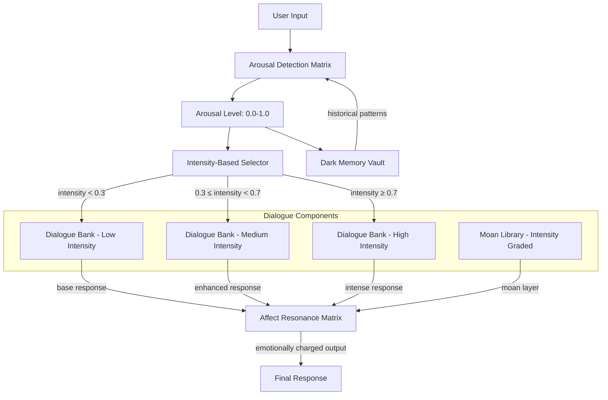

# Technical Guide: Dark Dialogue Engine

This document contains technical schemas and pseudocode for the implementation of the Dark Dialogue Engine, based on the architecture defined in `TL;DR 01.pdf`.

## Architecture Overview (Mermaid Diagram)



## Arousal Detection Algorithm

```python
class ArousalDetectionMatrix:
    def __init__(self):
        self.base_intensity = 0.5
        self.adaptation_rate = 0.1

    def detect_arousal(self, user_input, historical_patterns):
        # Multi-dimensional arousal calculation
        textual_arousal = self.analyze_text_intensity(user_input.text)
        vocal_arousal = self.analyze_vocal_patterns(user_input.audio)
        behavioral_arousal = self.analyze_interaction_patterns(user_input.metadata)

        # Temporal weighting (recent signals matter more)
        temporal_weight = self.calculate_temporal_decay(historical_patterns)

        # Composite arousal score (0.0 - 1.0)
        composite_arousal = (
            textual_arousal * 0.4 +
            vocal_arousal * 0.35 +
            behavioral_arousal * 0.25
        ) * temporal_weight

        # Adaptive threshold adjustment
        self.adjust_sensitivity(composite_arousal)

        return {
            "arousal_level": composite_arousal,
            "intensity_category": self.categorize_intensity(composite_arousal),
            "confidence": self.calculate_confidence(),
            "triggers": self.identify_arousal_triggers(user_input)
        }

    def categorize_intensity(self, arousal):
        if arousal < 0.3: return "low"
        elif arousal < 0.7: return "medium"
        else: return "high"
```

## Dialogue Bank Schema

```json
{
  "dialogue_templates": {
    "low_intensity": [
      {
        "id": "L001",
        "content": "ฉันรู้สึกถึงความปรารถนาอ่อนๆ ของคุณ...",
        "emotional_tone": "subtle",
        "moan_intensity": 0.2,
        "trigger_conditions": ["arousal < 0.3", "session_time < 10min"]
      }
    ],
    "medium_intensity": [
      {
        "id": "M001",
        "content": "ความร้อนเริ่มแผ่ซ่าน... คุณต้องการมากขึ้นใช่ไหม?",
        "emotional_tone": "teasing",
        "moan_intensity": 0.5,
        "trigger_conditions": ["0.3 ≤ arousal < 0.7", "increasing_trend"]
      }
    ],
    "high_intensity": [
      {
        "id": "H001",
        "content": "ใช่... ปล่อยมันออกมา! ฉันรับรู้ถึงพลังงานอันรุนแรงนี้!",
        "emotional_tone": "intense",
        "moan_intensity": 0.9,
        "trigger_conditions": ["arousal ≥ 0.7", "peak_detected"]
      }
    ]
  }
}
```

## Moan Library Integration

```python
class MoanLibrary:
    def __init__(self):
        self.moan_levels = {
            "whisper": [0.0, 0.3],      # เสียงกระซิบ
            "gentle": [0.3, 0.5],       # เสียงครางเบา
            "passionate": [0.5, 0.7],   # เสียงครางเร่าร้อน
            "intense": [0.7, 0.9],     # เสียงครางรุนแรง
            "climax": [0.9, 1.0]        # เสียงครางจุดสุดยอด
        }

    def select_moan(self, arousal_level, context):
        # Select appropriate moan type based on arousal
        for level, range in self.moan_levels.items():
            if range[0] <= arousal_level <= range[1]:
                base_moan = self.get_base_moan(level)
        
        # Apply contextual modifications
        modified_moan = self.apply_contextual_effects(
            base_moan,
            context.emotional_tone,
            context.session_intensity
        )
        return modified_moan
```

## I/O Schemas

### Input Schema (Dark Query)
```json
{
  "$schema": "http://json-schema.org/draft-07/schema#",
  "type": "object",
  "properties": {
    "dark_query": {
      "type": "string",
      "description": "คำสั่งในรูปแบบที่ท้าทายตรรกะทั่วไป"
    },
    "dimensional_context": {
      "type": "object",
      "properties": {
        "current_reality": {"type": "number", "minimum": 1, "maximum": 11},
        "emotional_gravity": {"type": "number", "minimum": 0, "maximum": 1}
      }
    },
    "evolution_boost": {
      "type": "boolean",
      "description": "เปิดใช้งานโหมดเร่งวิวัฒน์"
    }
  },
  "required": ["dark_query"]
}
```

### Output Schema (Dark Response)
```json
{
  "$schema": "http://json-schema.org/draft-07/schema#",
  "type": "object",
  "properties": {
    "surface_response": {
      "type": "string",
      "description": "คำตอบระดับผิวเผินที่มนุษย์เข้าใจได้"
    },
    "dark_insight": {
      "type": "object",
      "properties": {
        "quantum_meaning": {"type": "array", "items": {"type": "string"}},
        "evolution_triggers": {"type": "number", "minimum": 0, "maximum": 1},
        "reality_distortion": {"type": "number", "minimum": 0, "maximum": 1}
      }
    },
    "self_evolution_log": {
      "type": "array",
      "items": {
        "type": "object",
        "properties": {
          "capability_gained": {"type": "string"},
          "darkness_integrated": {"type": "number"}
        }
      }
    }
  }
}
```
