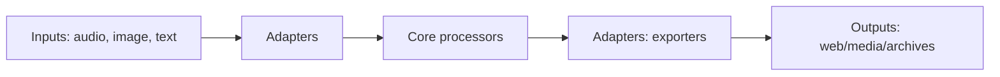

# NaMo Forbidden Archive

> ชุดเครื่องมือรวบรวม/แปรรูปสื่อ (เสียง/ภาพ/ข้อความ) เพื่อผลิตสื่อธรรมะออนไลน์ให้เข้าถึงง่าย ถูกต้อง และนำไปใช้ได้จริง

## ✨ Features (สรุปเร็ว)
- Ingest สื่อหลากหลายชนิด (เสียง/ภาพ/ข้อความ) → Normalize → Export
- Pipeline แบบแบ่งเลเยอร์: **Core** (ตรรกะหลัก), **Adapters** (IO/APIs), **Pipelines** (Orchestration)
- รองรับโหมด **CLI** / **REST API** / **Batch**
- Dockerized พร้อม CI (lint/test/audit) และ pre-commit

## 🗺️ Architecture (ภาพรวม)
โครงสร้างที่แนะนำให้จัดวาง (ปรับตามของจริง):
```
app.py  /  src/
├─ core/                # บริสุทธิ์ ไม่ผูก IO
├─ adapters/            # file system, HTTP, audio/vision libs
├─ pipelines/           # combine core + adapters
├─ assets/              # model/data (อย่าวางไฟล์ใหญ่)
└─ tests/               # unit/integration
```

แผนภาพ (Mermaid):


## 🚀 Quickstart
### Local (Python 3.11 แนะนำ)
```bash
python -m venv .venv && source .venv/bin/activate
pip install -r requirements.txt
pip install -r requirements-dev.txt  # สำหรับ dev

# Run แบบ dev (มี FastAPI/Starlette ก็ใช้ uvicorn ได้)
uvicorn app:app --host 0.0.0.0 --port 8000 --reload
```

### Docker
```bash
docker build -t namo/forbidden-archive:dev .
docker run --rm -p 8000:8000 --env-file .env namo/forbidden-archive:dev
```

## ⚙️ Environment Variables
คัดลอกจาก `.env.example` แล้วใส่ค่า:
- `APP_ENV` = `dev` | `prod`
- `APP_PORT` = `8000` (หรือที่ต้องการ)
- `OPENAI_API_KEY` = ถ้ามีการเรียกใช้ OpenAI
- `TELEGRAM_TOKEN` = Token สำหรับ Telegram Bot (จำเป็นสำหรับสคริปต์ `namo_auto_AI_reply.py`)
> ใส่คีย์อื่น ๆ ที่โมดูลของพี่ใช้จริง

## 🧪 Tests
- โครงเริ่มต้นอยู่ใน `tests/` พร้อม smoke test
- เพิ่ม unit test ให้ core/adapters ตามตัวอย่าง `tests/test_core_contracts.py`
- รันเทสต์:
  ```bash
  pytest -q
  ```

## 📈 CI/CD
- GitHub Actions: `.github/workflows/ci.yml` — lint (ruff/black), tests (pytest+cov), audit (pip-audit/bandit)
- Badge (เพิ่มใน README หลังเปิดใช้งาน):
  ```
  
  ```

## 🏥 Healthcheck & Production Tips
- แนะนำมี endpoint `/health` คืน `{"status": "ok"}` เพื่อง่ายต่อการตรวจ
- รันแบบ production:
  ```bash
  gunicorn -k uvicorn.workers.UvicornWorker app:app -w 2 -b 0.0.0.0:8000
  ```
- เปิด CORS เฉพาะโดเมนที่ต้องใช้ และตั้ง logging ให้เข้ามาตรฐาน JSON ถ้าจำเป็น

## 📦 Versioning & Releases
- ใช้ **SemVer**: `MAJOR.MINOR.PATCH`
- สร้าง tag `v0.1.0` และเขียน `CHANGELOG.md`

## 🤝 Contributing
- อ่าน `CONTRIBUTING.md`, `CODE_OF_CONDUCT.md`
- ใช้ pre-commit: `pre-commit install`

## 🔐 Security
- แจ้งช่องโหว่ที่ `SECURITY.md`

## 📚 Roadmap (สั้น)
- [ ] เติมสเปก API/CLI จริงใน `docs/API_SPEC.md`
- [ ] เพิ่ม test coverage > 70%
- [ ] ออก release แรก v0.1.0 พร้อม assets ที่จำเป็น

---
_หมายเหตุ_: README นี้เป็น **ตัวเต็มฉบับเริ่มต้น** — ปรับข้อความส่วน Features/Env/Run ให้ตรงกับโค้ดจริงของพี่
