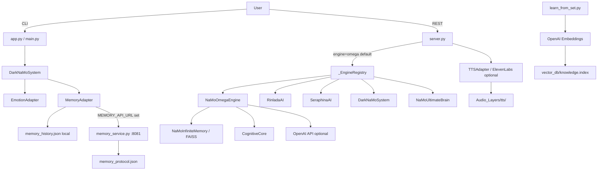

# Architecture Overview

## System Goals
- Clarity: แยก core logic ออกจาก IO และ external services
- Testability: โมดูลหลักต้องทดสอบแยกได้โดยไม่ต้องใช้ network หรือ filesystem
- Reproducibility: ใช้ config และ tooling เดียวกันกับ CI

## Directory Layout

```
core/              → pure Python engines + cognitive stack (no heavy IO)
adapters/          → thin wrappers for all external IO (OpenAI, ElevenLabs, memory JSON)
Core_Scripts/      → experimental / auxiliary scripts (not imported by server.py)
tests/             → pytest suite
docs/              → API and architecture specs
web/               → static frontend (served at /ui)
Audio_Layers/      → static audio assets  → served at /media/audio
Visual_Scenes/     → static image assets  → served at /media/visual
learning_set/      → input ZIPs for FAISS knowledge base
tools/             → one-off utility scripts
```

## Entry Points

| File | Engine | Interface |
|---|---|---|
| `server.py` | all engines via `_EngineRegistry` | REST API (port 8000) |
| `memory_service.py` | standalone | REST API (port 8081) |
| `app.py` | `DarkNaMoSystem` | CLI |
| `main.py` | `CharacterProfile` | CLI |

## Engine Registry

`server.py` maintains a lazy-singleton `_EngineRegistry`.
Engines are registered by name at startup; instances are created on first use.

| Name | Class | File |
|---|---|---|
| `omega` | `NaMoOmegaEngine` | `core/namo_omega_engine.py` |
| `rinlada` | `RinladaAI` | `rinlada_fusion.py` |
| `seraphina` | `SeraphinaAI` | `seraphina_ai_complete.py` |
| `dark` | `DarkNaMoSystem` | `core/dark_system.py` |
| `ultimate` | `NaMoUltimateBrain` | `core/namo_ultimate_engine.py` |

`DEFAULT_ENGINE` env var selects the engine pre-loaded at startup (default: `omega`).
Per-request engine override is supported via the `engine` field in the request body.

All engines inherit `BasePersonaEngine` (`core/base_persona.py`) and implement:
```python
def process_input(user_input: str, session_id: str | None = None) -> dict
```

Return shape (do not change without updating `server.py` and tests):
```python
{
    "text": str,
    "media_trigger": {"image": str | None, "audio": str | None, "tts": str | None},
    "system_status": {"arousal": str, "sin_status": str, "active_personas": list}
}
```

## Cognitive Stack (core/)

Optional subsystem activated by `self.init_cognition()` in an engine's `__init__`.

| Module | Class | Responsibility |
|---|---|---|
| `core/emotion_engine.py` | `EmotionEngine` | 5-D continuous emotion with momentum + decay |
| `core/cognitive_stream.py` | `CognitiveStream` | Internal monologue injected into LLM prompt |
| `core/learning_engine.py` | `LearningEngine` | Evolves 4 persona traits, persists to JSON |
| `core/base_persona.py` | `CognitiveCore` | Bundle: emotion + thoughts + learning |

`CognitiveCore.process()` returns:
```python
{
    "emotion":        dict,   # EmotionEngine.snapshot()
    "monologue":      str,    # thought queue as prompt string
    "autonomous":     str | None,
    "persona_traits": dict,   # boldness / playfulness / vulnerability / expressiveness
    "preferences":   dict,
}
```

## Per-Session State Isolation

All mutable state (arousal, sin_system, personas, intensity) is keyed by `session_id`:

| Engine | Attribute |
|---|---|
| `NaMoOmegaEngine` | `_session_states: dict[str, dict]` |
| `NaMoUltimateBrain` | `_session_arousal: dict[str, int]` |
| `DarkNaMoSystem` | `_session_intensity: dict[str, int]` |
| `RinladaAI` | `_session_arousal: dict[str, int]` |

A missing `session_id` falls back to the `"default"` key.

## Data Flow (Mermaid)



## Memory Adapter

`adapters/memory.py` — `MemoryAdapter`:
1. Writes every interaction to a local JSON file (`memory_history.json`)
2. If `MEMORY_API_URL` is set, also forwards to the memory service via HTTP POST
3. Remote failure is logged and silently swallowed — local write always succeeds first

## Streaming

`BasePersonaEngine.stream_input()` provides a default sentence-level streaming
simulation for engines that don't override it. `NaMoOmegaEngine` yields chunks
from the OpenAI streaming API when available.

The `/v1/chat/stream` endpoint wraps `stream_input()` in a Server-Sent Events
response using `asyncio.Queue` for thread-safe producer/consumer handoff.

## Notes
- `server.py` and `memory_service.py` run as separate processes
- `learn_from_set.py` requires `OPENAI_API_KEY` and a `set.zip` in `learning_set/`
- All secrets go through `config.py` → `Settings`; never use `os.getenv()` in business logic
